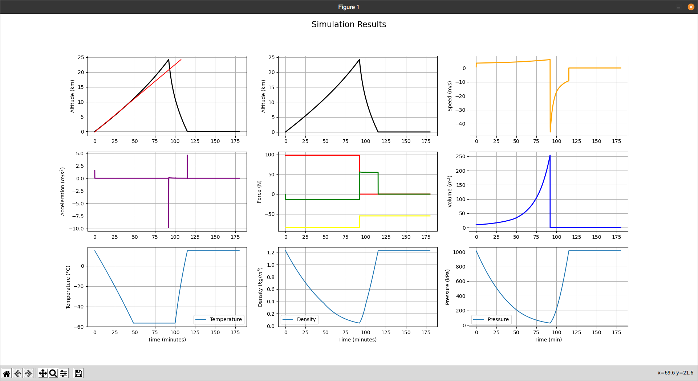

# Probe Simulator
Python Simulation of a High Altitude Balloon ascent and descent.

## Objective 
Create a tool to help experiments involving HABs. Currently focusing efforts on
the design of an Altitude Control System.

## State
**Working!**
Seems to work, but a timestep >= 1s fails to converge.


## Dependencies
Just: 
 - `numpy`
 - `matplotlib`

Even so, please, use a virtual environment

## How to use
```shell
$ virtualenv .venv
$ source .venv/bin/activate
(.venv) $ pip3 install -r requirements.txt
(.venv) $ python3 main.py
```

## Code Structure

 - `Balloon.py`: Contains the numeric models (inside a Class) that calculate parameters, such as: 
 drag, buoyance, volume and density
 - `Air.py`: free functions that implement NASA's standard Atmosphere Model.
 - `Integrator.py` and `Simulator.py`: Code taken from previous simulation project. 
 Implements, simple 4th order Runge-Kutta integration.
 - `Utils.py`: some conversion functions that don't have a good place yet
 - `Local.py`: Placeholder for variables that could be of use in a future state of the project

The `main.py` code then creates an object of the class Balloon, and passes its collection o models
to the Simulator,  that then does the integration step.
